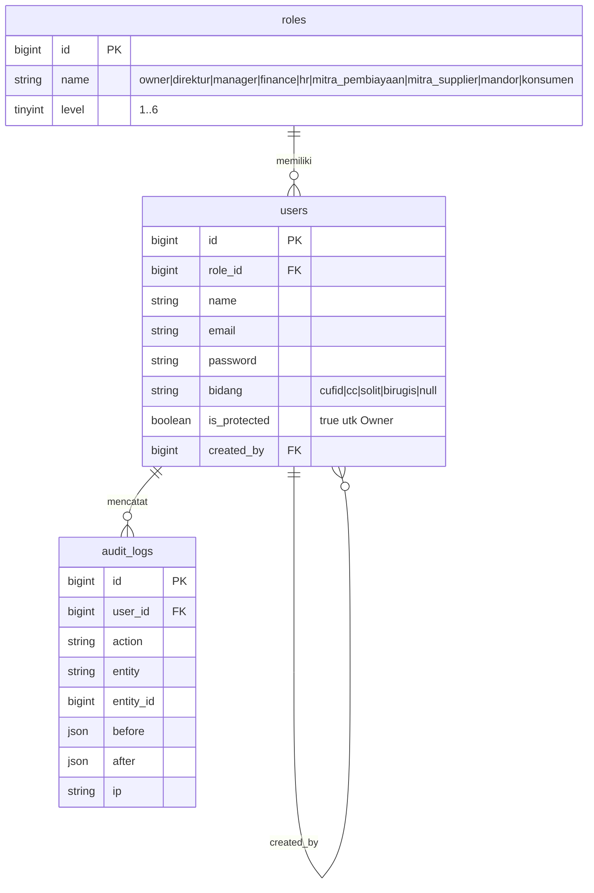
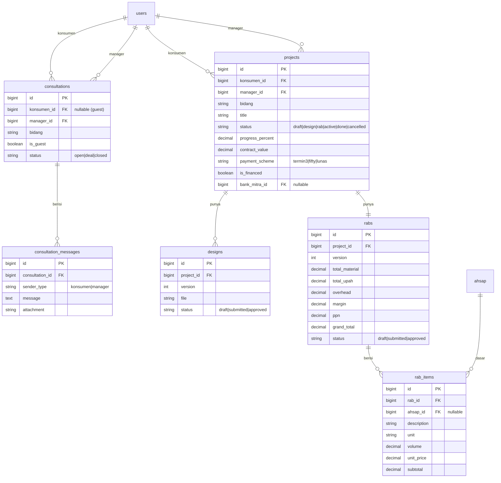
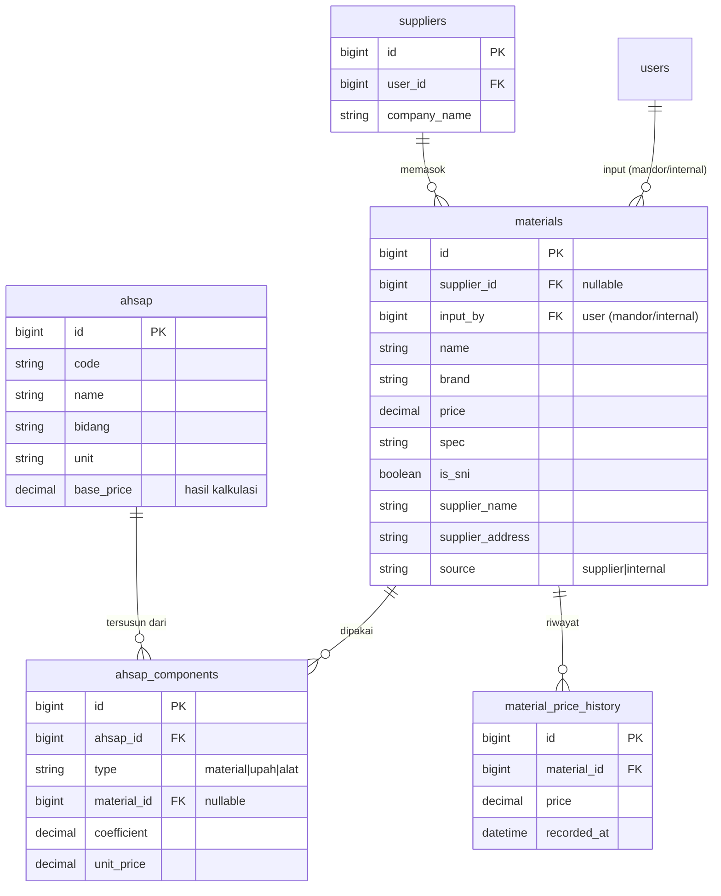
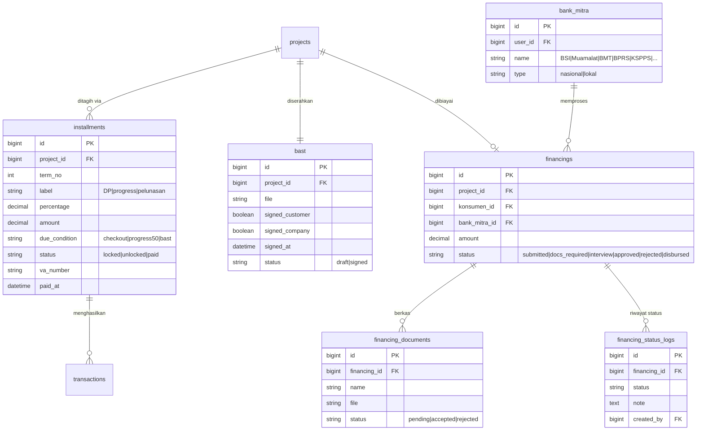
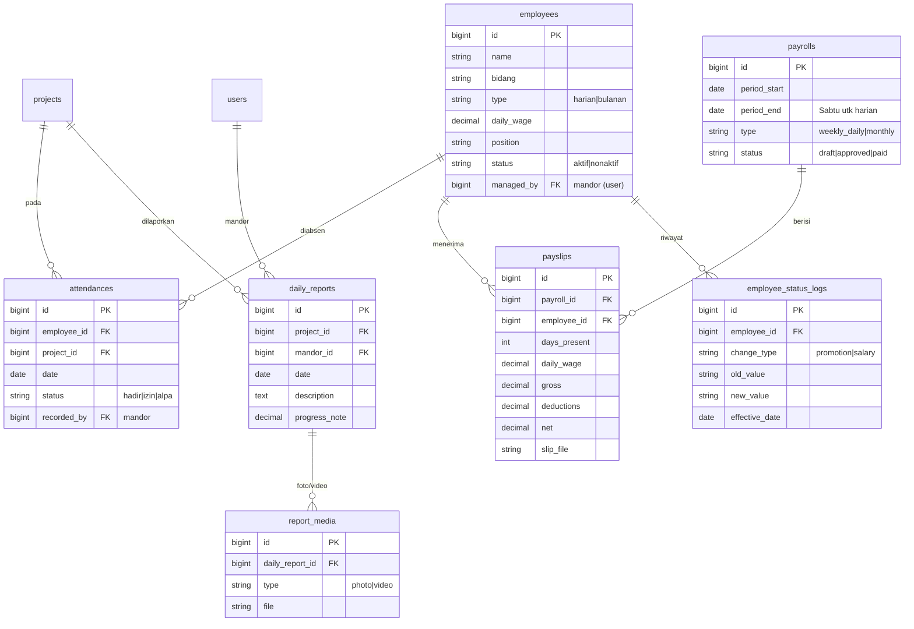
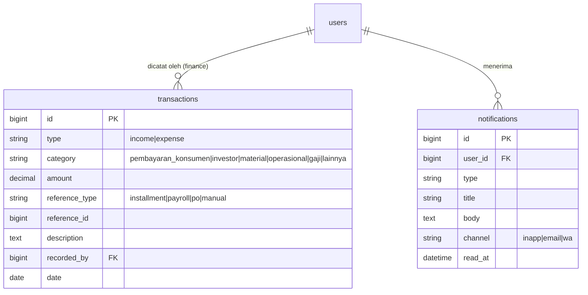

# Deliverable 1 — ERD & Struktur Database (web-cm)

Skema database untuk Web Sistem CV. Cimandiri. Dirancang relasional (MySQL/PostgreSQL), mendukung RBAC 6 level, alur pemesanan–pembayaran–pembiayaan, operasi lapangan, HR/payroll, dan keuangan.

**Konvensi**
- Setiap tabel punya `id` (PK, bigint auto-increment), `created_at`, `updated_at`.
- Soft delete (`deleted_at`) untuk entitas penting (users, projects, transactions).
- FK dinamai `<entitas>_id`.
- Enum ditulis sebagai daftar nilai; di MySQL boleh `ENUM` atau tabel referensi.

---

## A. Diagram per Domain

### A.1 Autentikasi & RBAC

### A.2 Konsultasi & Penjualan (Sales)

### A.3 Master AHSAP & Material

### A.4 Pembayaran, BAST & Pembiayaan

### A.5 Lapangan (Mandor), HR & Payroll

### A.6 Keuangan & Notifikasi

---

## B. Data Dictionary (ringkas, per domain)

**Autentikasi & RBAC**
- `roles` — 9 peran dipetakan ke 6 level (Owner=1, Direktur=2, Manager/Finance/HR=3, Mitra Pembiayaan/Supplier=4, Mandor=5, Konsumen=6).
- `users` — semua akun login. `is_protected=true` untuk Owner (tak bisa dihapus). `created_by` melacak hierarki pembuatan. `bidang` membatasi Manager/Mandor ke unit usahanya.
- `audit_logs` — jejak perubahan untuk modul akun & keuangan.

**Sales**
- `consultations` / `consultation_messages` — chat konsumen ke Manager per bidang. **Chat tamu (tanpa login) TIDAK disimpan di tabel ini** — disimpan di session/cache dan dihapus saat sesi berakhir. Hanya chat akun login yang persist.
- `projects` — proyek/produk hasil deal. Menyimpan skema bayar & status pembiayaan.
- `designs`, `rabs`, `rab_items` — desain & RAB ber-versi; item RAB bersumber dari AHSAP.

**Master**
- `ahsap` + `ahsap_components` — Analisa Harga Satuan Pekerjaan; komponen merujuk material → harga otomatis terhitung.
- `materials` + `material_price_history` — gabungan supplier + input internal/mandor; menyimpan SNI, toko, alamat, riwayat harga.
- `suppliers` — profil mitra supplier (Level 4).

**Transaksi**
- `installments` — termin pembayaran; `due_condition` mengatur kapan termin terbuka (checkout / progres 50% / BAST).
- `bast` — berita acara serah terima; status `signed` memicu termin pelunasan.
- `bank_mitra`, `financings`, `financing_documents`, `financing_status_logs` — alur pembiayaan bank, berkas, dan riwayat status.

**Lapangan & HR**
- `employees` — **entitas terkelola, bukan akun login**. Dipakai mandor untuk absensi & HR untuk penggajian.
- `attendances`, `daily_reports`, `report_media` — absensi + dokumentasi harian; media otomatis tampil di dashboard konsumen.
- `payrolls`, `payslips`, `employee_status_logs` — penggajian (harian dibayar mingguan tiap Sabtu) & slip gaji.

**Keuangan & Notifikasi**
- `transactions` — buku kas pemasukan/pengeluaran; otomatis terisi dari `installments` (income) & `payrolls`/PO material (expense).
- `notifications` — notifikasi multi-kanal.

---

## C. Catatan Implementasi RBAC

1. **Penegakan akses** di middleware/policy berdasarkan `roles.level` + `users.bidang`.
2. **Owner permanen:** blokir operasi delete bila `is_protected=true`. Tidak ada peran yang bisa menghapus dirinya sendiri (cek `auth()->id() !== target->id`).
3. **Level 4 (Mitra)** tidak memiliki kemampuan kelola akun apa pun.
4. **Bank monitoring:** scope query proyek bank = `projects WHERE bank_mitra_id = auth_user.bank_mitra_id` (read-only). Bank melihat progres, laporan harian, media, & BAST hanya untuk proyek tersebut.
5. **Mandor:** tidak punya akun bawahan; hanya CRUD `employees` (entitas) dan `attendances`/`daily_reports` pada proyek bidangnya.

---

## D. Indeks & Performa (saran)
- Index pada FK utama (`project_id`, `konsumen_id`, `bank_mitra_id`, `employee_id`).
- Index komposit `attendances(employee_id, date)` untuk rekap payroll.
- Index `installments(project_id, status)` untuk dashboard tagihan.
- Partisi/arsip `audit_logs` & `notifications` bila volume besar.
